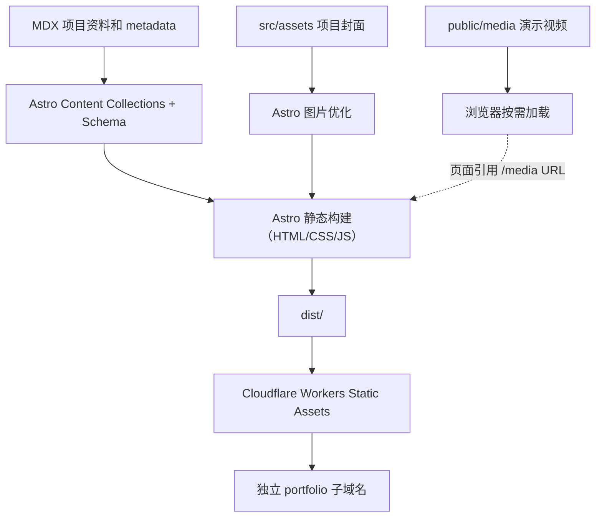

# 系统整体架构（V1）

## 目标和边界

网站是面向招聘的公开 **UE Gameplay / 客户端开发作品集**，核心是可验证的技术案例，而不是实时游戏服务、博客镜像或通用个人主页。独立 Git 仓库 `ice-portfolio`；博客可以互不链接，二者独立构建和发布。

### 用户路径

- **招聘浏览者**：进入「让规则凝成世界」冰晶首页 → 点击「进入作品展厅」看到海报墙 → 选作品进入独立展映厅 → 返回大厅或联系。
- **技术面试官**：首页选片或通过独立深链直达作品 → 观看真实演示 → 阅读职责、系统实现与验证边界 → 返回大厅选下一部。
- **站点维护者**：新增一篇项目 MDX 和对应媒体 → 构建时 schema 校验 → 生成静态项目页面 → 独立部署。

## 页面信息架构

```text
/                       用户选定的 V3 冰晶开场＋作品海报选片大厅
/projects/              额外作品索引（可选扩充，不替代首页选片）
/projects/[slug]/       独立展映厅（真实演示 / 职责 / 架构 / 实现 / 验证）
/about/                 背景、技术方向、联系渠道
/resume/                简历概览及 PDF 下载（需授权上传版本）
/404                    自定义空状态
```

不默认创建博客、留言板、登录页、实时状态监控页；V1 首页导航以“作品 / 关于 / 简历”三项为主。

## 逻辑架构



**注意：** 这是拟定的数据流，不是已经运行的部署链路。

## 拟定代码布局（下一阶段创建）

```text
ice-portfolio/
├─ docs/                         决策与施工文档（本阶段）
├─ public/
│  ├─ media/projects/<slug>/    视频、poster、下载媒体（注意体积）
│  └─ resume/                   审核后的公开 PDF
├─ src/
│  ├─ assets/projects/<slug>/   可优化的图片资源
│  ├─ components/               Header、Hero、ProjectCard、MediaViewer、CodeCallout 等
│  ├─ content/projects/         一项目一篇 .mdx
│  ├─ content.config.ts         Zod 项目数据模型
│  ├─ layouts/                  BaseLayout、ProjectLayout
│  ├─ pages/                    Astro 文件路由
│  └─ styles/                   tokens.css、global.css、组件样式
├─ astro.config.mjs
├─ wrangler.jsonc
└─ package.json
```

上述路径统一由文件归属管理；不要把媒体文件、业务数据和视觉代码混写进单个首页组件。

## 动效、组件与媒体子架构

- [动效运行时架构](04-motion-runtime.md)：用静态页面 → CSS → 少量 JS/WAAPI → 经评审的 GSAP 逐层增强，所有增强可关闭。
- [组件与数据接口](05-component-contracts.md)：页面、组件、schema 和 view model 的边界，避免重复硬编码。
- [媒体与性能](06-media-performance.md)：图像优化、真实 UE 录屏审核、视频按需请求、移动端降级。
- [页面转场](../decisions/ADR-0003-navigation-transitions.md)：原生 MPA 导航优先，跨文档 View Transitions 是可选增强；ClientRouter 非默认。
- [动效分镜](../design/03-motion-storyboard.md)：Hero 是视觉焦点，项目和技术章节的动效让位于作品阅读。

**最新用户确认的信息架构：** [S1 V4 冰晶影院选片与独立展映厅](../design/07-s1-cinema-navigation-v4.md)。首页先保留用户认可的 V3 「让规则凝成世界」艺术开场，再通过海报墙供面试官选择作品；所有项目详情都拥有独立 URL，而不在首页滚动展开完整案例。

## 组件职责

| 组件 / 模块 | 唯一责任 | 不应做 |
| --- | --- | --- |
| BaseLayout | 页面 head、导航、布局骨架、SEO 公共属性 | 决定某项目的职责归属 |
| ProjectPoster（ProjectCard 的主展示变体） | 封面、简介、个人贡献摘要、独立案例链接 | 首页展开长技术正文或拦截页面导航 |
| ScreeningLayout / ProjectLayout | 独立项目页章节、媒体、返回大厅和下一部作品 | 把案例做成首页隐藏区或解析 uasset |
| MediaViewer | poster、播放、暂停、字幕说明与按需加载 | 首屏自动并行下载所有视频 |
| TechEvidence | 技术证据、代码出处、测试状态的可读展示 | 宣称不存在的构建/网络测试 |
| Design Tokens | 颜色、字号、间距、玻璃/折射强度 | 以零散魔法常量覆盖页面 |

## 质量属性

- 优先阅读体验、可发现性、可维护性、快速打开，以及真实技术内容。
- 静态资源默认公共可访问；不可在打包前嵌入密码、令牌、内部文件。
- 每个技术案例必须能通过永久链接直接访问，且在移动端读得清楚。
- 框架选择和业务内容解耦；后续更换主题、域名、部署平台不应要求重写项目内容。

## 冻结的接口

1. 项目 ID / slug 唯一且发布后稳定，链接固定为 `/projects/<slug>/`。
2. 内容数据由 Content Collections 校验；首页与详情都从同一数据源读取。
3. `/media/projects/<slug>/` 路径只放允许公开且已压缩的演示文件。
4. `src/assets/` 的可优化图片与 `public/media/` 的直接 URL 视频分开。
5. 不反向依赖 fuwari 的 build、组件、部署或博客内容文件。
