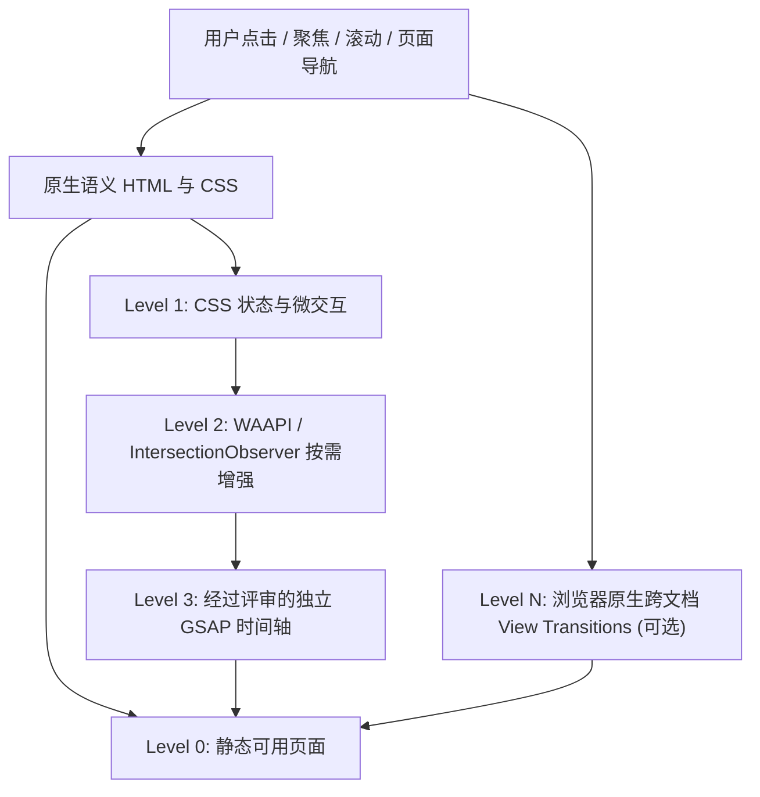

# 动效运行时架构：渐进增强，而非动画驱动网站

- 版本：V1 设计合同，未编写或运行前端代码
- 产品定位：精美动效的 UE 作品展示网站；**非 WebGL 游戏、非交互式 3D 展馆**
- 相关决策：[ADR-0002](../decisions/ADR-0002-motion-media.md)、[ADR-0003](../decisions/ADR-0003-navigation-transitions.md)
- 视觉规范：[动效分镜](../design/03-motion-storyboard.md)

## 1. 分层职责



**核心契约：每一层都能被移除，而页面导航、内容阅读、链接、视频基本控制仍然可用。** 不创建全局「动画大管家」作为渲染或路由前提。

| 层级 | 执行环境 | 应处理的事情 | 禁止承担的责任 |
| --- | --- | --- | --- |
| Level 0 | Astro SSG | 标题、项目、代码、视频 poster、所有链接 | 等待脚本才能看到正文 |
| Level 1 | CSS | hover、focus、按钮反馈、卡片遮罩、低成本 reveal | 复杂多段时间轴和不断更新的滚动位置 |
| Level 2 | 必要时少量 JS / WAAPI | 一次性入场、视口触发、媒体弹层状态 | 大面积逐帧重排和持续的 scroll 监听 |
| Level 3 | **条件引入** GSAP | 有明确艺术分镜的 Hero、镜头式项目切换 | 普通 hover、导航链接或简单 opacity 动画 |
| 页面转场 | 原生 CSS View Transitions（试验项） | 同源页面间小幅平滑衔接 | 替代正常页面导航、制造加载遮挡 |

## 2. 动效功能模块（建议，不是必须全部生成）

```text
src/
  components/
    motion/
      Reveal.astro                渐进显现的声明式容器，非必须 JS
      MotionBoundary.astro        识别 reduced-motion，避免装饰层夺焦点
    visuals/
      CrystalAccent.astro         静态折射边缘/高光装饰
      HeroArt.astro               负责作品封面和视觉层次
  scripts/
    motion/
      reveal.ts                   可选：IntersectionObserver 的一次性触发
      hero-sequence.ts            可选：Hero 多段分镜的局部时间轴
      cleanup.ts                  可选：生命周期注销帮助函数
  styles/
    motion-tokens.css             duration/easing/距离/强度统一定义
```

**不设全局 MotionProvider，不默认引入 React，除非以后真实需求证明需要共享客户端状态。** 各组件拥有自己的 DOM 范围与事件清理；同一元素的 transform 同时只由一个层级控制。

## 3. 组件生命周期

动画相关组件统一满足下列状态：

```text
静态已渲染
    ├─ JS 不可用 / reduced-motion → 直接保持最终可读状态
    └─ 增强条件成立 → 准备动画 → 单次播放 → 最终稳定状态
                                 ↘ 被卸载 / 页面离开 → 停止并清理
```

- 页面 DOM 先拥有可读的最终视觉状态；JS 初始化**成功之后**才允许对装饰层应用隐藏的预备姿态。不得在全局 CSS 中把 `[data-reveal]` 默认设成 `opacity:0`。
- IntersectionObserver 仅用于一次性出现，不要反复进出触发导致阅读抖动；unobserve/disconnect。
- 动画任务结束必须释放 event listeners、requestAnimationFrame、ResizeObserver、IntersectionObserver；如引入 GSAP 使用 `gsap.matchMedia().revert()` 或等价的 cleanup。
- 页面导航优先原生多页加载，每次都有天然生命周期边界；如后续改 ClientRouter，必须补充 Astro 导航事件中的初始化和清理。
- 不允许滚动锁定页面等待动画结束，禁用 scroll hijacking。

## 4. 优先级与抢占

| 触发 | 最高优先级 | 冲突处理 |
| --- | --- | --- |
| 用户点击导航、返回、触控滚动 | 用户操作 | 立即结束 / 跳过装饰动画 |
| 视频播放、暂停、Seek | 媒体控件 | 动效不得覆盖控件或强制重播 |
| `prefers-reduced-motion` 变化 | 用户系统偏好 | 停止正在运行的非必要动效并还原最终状态 |
| 页面不可见（visibility hidden） | 资源与电量 | 暂停或终止连续装饰动画 |
| 页面滚动到章节 | 阅读内容 | 一次性 Reveal 不阻碍标题与链接访问 |
| 鼠标 hover | 视觉反馈 | 触摸设备退化为无 hover 的静态交互 |

## 5. 性能策略

- 优先 `opacity` 和 `transform`；阴影变化、模糊核与滤镜动画要局部评估。
- `will-change` 不可对大量节点永久开启，仅在真正需要的短时过渡内使用。
- 不启用全站高频 `requestAnimationFrame` 循环、页面级动态模糊或粒子系统。
- 分屏或显卡较弱时只保留基础焦点反馈、静态背景和真实作品图。
- 动画是否有美感要靠设计评审，**不是靠持续时间短、FPS 高就可自动通过**。

## 6. 验收矩阵

| 场景 | 最低期望 |
| --- | --- |
| JS 关闭 | 首页、项目索引、详情正文全部可读 |
| reduced-motion | 不出现视差、循环装饰与大幅飞入；链接可用 |
| 触控/窄屏 | 不依赖 hover 发现主链接，帧率与可触控性合理 |
| 慢网络 | 先显示清晰海报与文字，不等动画才出现第一屏 |
| 返回/前进/直接刷新 | 页面状态与焦点正常，不出现重复动画和残留蒙层 |
| 视频播放期间 | 动画层不会抢占声音、控件或滚动 |
| 不支持 View Transitions 的浏览器 | 正常 HTML 页面导航 |

## 7. 失败路径

- 装饰动画初始化异常 → 捕获并回到静态稳定状态。
- 设计动效无法满足 CPU/GPU 预算 → 局部降级或去掉该动效，不降低项目可读性。
- 某页面交互复杂到需要 React Island → 单独提交 ADR 说明状态管理与懒加载价值，不能升级整站。
