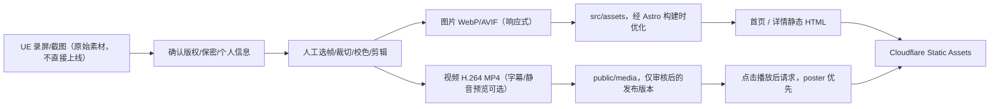

# 媒体管线、性能预算与低配降级

- 状态：设计目标；**非真实性能测试结果**
- 适用页面：首页、项目索引、项目技术详情
- 参考：[动效架构](04-motion-runtime.md)、[技术选型](../decisions/ADR-0001-tech-stack.md)

## 1. 处理流程

媒体应可单独替换而不改动 MDX 结构。原始 UE 视频、Blender 源文件和未裁切 4K 材料不因建站而自动上传到公开仓库。

## 2. 媒体类别契约

| 资源 | 存储建议 | 加载时机 | 无法加载的退化 |
| --- | --- | --- | --- |
| Hero 关键图 | `src/assets/projects/` | 初始 HTML 尽早获取，构建产多尺寸 | 同比例纯色底+标题+项目入口 |
| 首页精选卡图 | 同上 | 第一张可适当高优先级，其余按区域 lazy | 保留标题、职责与链接 |
| 项目正文大图 | 同上 | `loading=lazy`，尺寸已知 | ALT+文字说明 |
| 视频 poster | `src/assets/` 优先优化；若视频 poster 独立直接 URL，也需审核 | 视频前显示 | 可访问播放按钮和文字替代 |
| 正文演示视频 | `public/media/projects/<slug>/` | 点击后再填入 source / `preload="none"` | poster + 视频不可用状态与文字摘要 |
| 下载 PDF | `public/resume/` | 用户点击下载/新标签 | 不提供虚假下载按钮 |
| 装饰光效纹理 | CSS/SVG/小幅图片 | 低优先级 | 完全隐藏，不影响阅读 |

Astro `<Image />`、`<Picture />` 对 `src/assets` 的本地图片提供构建期转换，建议适当设置 `sizes` / `widths`（以锁定版本 API 为准）。`public/` 直接引用资源不会自动变成多档优化版本。

## 3. 视频发布细则

1. 从真实 UE 演示剪辑到最能体现技术工作的片段，优先包含清晰 HUD、行为前后关系和职责解释。
2. 常规演示先选择兼容性好的 MP4（H.264 + AAC 如有声音）；WebM 是可选补充，不强制双格式。
3. 有解说时提供字幕文件或等价文本；无声音也需给出文本背景与操作解释。
4. poster 始终独立存在。首页**不要**无条件 `autoplay`、`preload=auto`，视频组件应让用户显式播放。
5. 大视频是否拆分、是否使用 Cloudflare R2/Stream 由真实大小和流量再决策，不在文档阶段购买额外服务。
6. CDN 缓存内容使用基于文件名的版本化策略，避免更新视频后引用旧内容。
7. 审查成品不泄露开发环境路径、个人账号、密钥或他人受保护素材。

## 4. 暂定资源预算（S2/S5 阶段实测后调整）

| 项目 | V1 规划目标 | 备注 |
| --- | --- | --- |
| 初始页面关键 JS | 尽量接近零；交互脚本初始压缩包建议控制在 **80 KB gzip 以下** | 仅预算上限提案，不是 Astro 自动保证 |
| Hero 关键图 | 优先给移动与桌面不同响应式尺寸，避免直接传 4K 原图 | 以实际构图和清晰度定最佳压缩 |
| 可选动效库 | 不进入初始 JS，按需加载并有删除回退方案 | 未选定 GSAP 作为默认依赖 |
| 详情视频 | 不属于初始页面关键路径 | 点击再加载，按实际大小决定存储 |
| LCP / CLS / INP | 以 Web Vitals good 目标 **≤2.5s / ≤0.1 / ≤200ms** 测试 | Lighthouse 与真实设备都记录 |
| 页面布局 | 图片视频必须预留宽高 / 比例 | 避免动态加载造成标题跳动 |

以上是**目标而非验收已通过**。若高质量视频与流量成本冲突，视频保持用户点击加载，不以压缩到糊图为代价追求分数。

## 5. 降级矩阵

| 条件 | Hero | 动效 | 视频 |
| --- | --- | --- | --- |
| 桌面、性能正常 | 清晰静态图 + 局部艺术质感 | CSS / 经过验证的时间轴 | 点击播放高清版本 |
| 手机 / 触屏 | 按设备裁切的清晰封面 | 少量短促响应；无鼠标视差 | poster、按需加载 |
| `prefers-reduced-motion` | 静态图 | 关闭非必要运动与连续动画 | 视频由用户决定是否播放 |
| 节省流量 / 弱网 | 更轻量适配图 | 仅必要状态反馈 | 不预取、不自动下载视频 |
| JS 被禁用 | 静态图与 HTML | 可无动画 | 仍可用原生 `<video controls>`，如果采用自定义懒加载需提供链接回退 |

**注意：** `saveData` / 网络类型等 API 支持不一致，不可依赖此类检测保证核心内容可访问。

## 6. 性能回归收集

每次 S4/S5 变更都记录：Git SHA、设备、浏览器、网络模拟、Lighthouse 报告、LCP/CLS/INP、脚本大小、媒体传输量、首屏截图与手动可用性。任何华丽动效若引入持续主线程阻塞，应局部回退，不对整站降级视觉层次。
