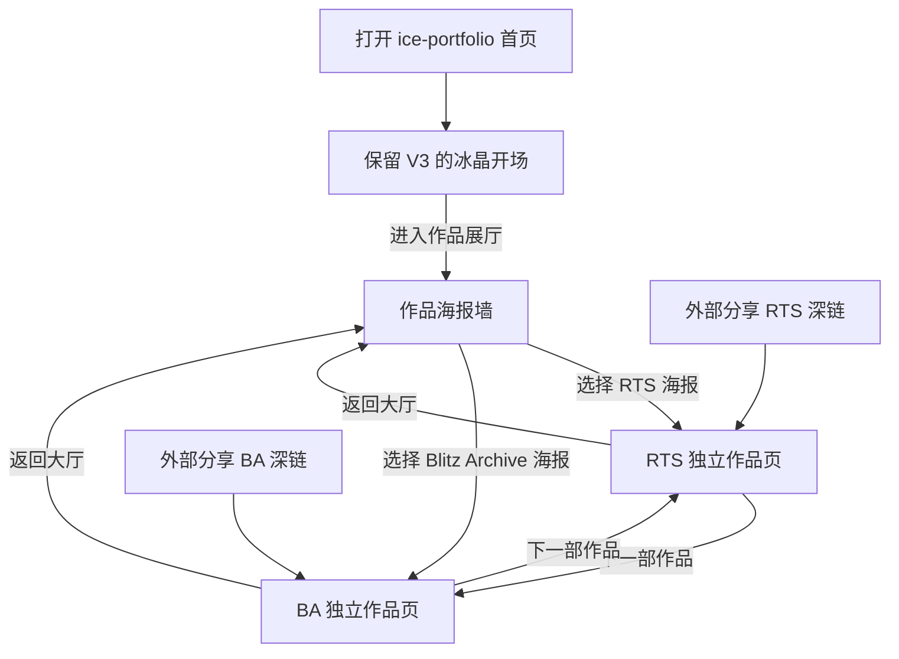

# S1 V4：冰晶电影院 · 独立作品展映厅

- 日期：2026-10-08
- 状态：**站点信息架构经用户需求确认；V4 纯静态跨页面原型已落盘，最终视觉与真实媒体仍待验收**
- 原型首页：[影院大厅](../prototypes/cinema-v4/index.html)
- 作品一：[RTS 展映厅](../prototypes/cinema-v4/rts.html)
- 作品二：[Blitz Archive 展映厅](../prototypes/cinema-v4/blitz-archive.html)
- 继承 V3：[冰晶环境背景](06-s1-glacial-background-v3.md)

## 1. 用户要求（本轮语义）

**最新确定的美术方向（2026-10-08）：保留 V3 的「让规则凝成世界。」冰晶主视觉及原有中英文介绍。不得恢复 V4 初稿的「请选择一个世界。」标题。** 页面顺序已改为：冰晶 Hero →「进入作品展厅」CTA → 两张可点击海报 → 不同的独立作品页面。原先要求“第一屏同时显示两张海报”的旧约束已被这一明确反馈取代。

**面试官像走进电影院挑选电影一样挑选作品。**

V3 的长首页从「首页主视觉 → 滚动看项目 → 继续滚动看技术案例」与这个预期不一致。用户不是在要求折叠菜单或一段更炫的转场，而是在修改最重要的**信息架构和浏览方式**。

- **大厅（首页）负责选择，不负责讲完案例。**
- **每个展品拥有独立浏览器页面、独立 URL、独立阅读动线。**
- **从大厅选择哪部作品，就进入哪部作品的完整展映厅。**
- **能够原路返回大厅、换片、用浏览器前进/后退。**
- **分享某项目深链时直接进入该项目，不需要先播放首页转场。**

## 2. 站点地图：未来 Astro

```text
/                              V3 冰晶「让规则凝成世界」首屏 + 海报选片大厅
  ├─ /projects/rts-gameplay-systems/    RTS 完整展示/技术案例
  ├─ /projects/blitz-archive/          BA 完整展示/技术案例
  ├─ /projects/                         （可选）扩充作品目录，当项目较多时使用
  ├─ /about/                            职业介绍 / 联系
  └─ /resume/                           经过公开审查的简历
```

当前 **V4 本地原型** 用三个可双击打开的 HTML：`index.html`、`rts.html`、`blitz-archive.html`。这些只是设计原型文件路径，不代表正式 Astro 路由已经实现或部署。

## 3. 导航流程



技术实现约束：链接是原生 `<a href="/projects/<slug>/">`，Astro 以 SSG 单独构建每页；可选原生 View Transitions 仅为视觉增强，没有浏览器支持时直接正常跳转。不得用弹层替代项目详情页，不为了动画锁住导航，不默认引入 React Router 或 Astro ClientRouter。

**作品区文案（2026-10-08 修订）：** 原标题「正在展映的作品。」改为更简洁的「作品选集。」；说明调整为「选择一个项目，进入独立的作品页面。了解玩法目标、个人职责与技术实现。」保留海报式展陈，但不把个人技术作品硬说成正在上映的电影，也不预先承诺所有案例都已经有玩法演示素材。

## 4. 首页视觉语法：冰晶影院，而不是传统产品网格

| 区块 | 职能 | 理想视觉 | 禁止 |
| --- | --- | --- | --- |
| 壁面 / 灯光 | 让整个大厅有冰的空间氛围 | 冰壁、冻纹、少量折射、两侧冷暗，中间柔光 | 粒子、无意义 HUD 线框 |
| 主标题 | 传达个人 Gameplay/C++ 定位与冰晶审美 | 「让规则凝成世界。」＋「凝固一瞬光，构建一个世界。」＋英文副标题 | 不能恢复「请选择一个世界。」 |
| 作品海报墙 | Hero 后紧接的选择区 | 「进入作品展厅」直接定位；两张整图可点击、进入不同 URL | 首页展开长技术文章 |
| 海报文案 | 在进入前解释差异 | 项目标题、引擎、本人职责 1 行 | 在卡片内部展开长篇技术正文 |
| 档期信息 / 简介 | 建立「电影选片」仪式感 | FILM 01/02、展映厅入口与光线状态 | 检票、倒计时、片头遮挡 |
| About 摘要 | 次级内容 | 作品之后简洁出现，独立页面待实现 | 让简历区抢首屏注意力 |

一张海报必须由**整张可聚焦且可点击的链接**承担跳转；不会发生点击海报不同区域进入不同状态的情况。

## 5. 展映厅页面：电影感进入，工程信息留住

```text
单独 URL
  → 顶部可见「返回选片大厅」
  → 项目名称 / 引擎 / 一句话玩法目标
  → 全宽实机画面（现原型为明显占位）
  → 个人职责、项目状态
  → 真实演示视频（未审核则不生成假播放控件）
  → 01 项目背景
  → 02 系统关系与关键实现
  → 03 证据、职责和未验证项
  → 下一部作品 / 返回大厅
```

与电影比喻的边界：作品页应有展映厅的沉浸感，但主要价值是让面试官快速获取工程证据。目录、文字、代码、返回按钮必须容易发现，不应该模仿真实电影院的黑屏或观影限制。

## 6. 当前原型结构

```text
docs/prototypes/cinema-v4/
├─ index.html                   选片大厅
├─ rts.html                     RTS 独立作品页
├─ blitz-archive.html           BA 独立作品页
├─ cinema.css                   三页共享视觉、动效与响应式
├─ cinema-hero.css              仅首页保留 V3 冰晶开场样式
├─ v4-lobby-desktop.png         Edge 桌面截图
├─ v4-lobby-mobile.png          Edge 手机尺寸截图
├─ v4-rts-desktop.png           RTS 详情桌面截图
├─ v4-ba-desktop.png            BA 详情桌面截图
├─ v4-lobby-mobile-true390.png  CDP 390 CSS px 首页
├─ v4-rts-mobile-true390.png    CDP 390 CSS px RTS
├─ v4-ba-mobile-true390.png     CDP 390 CSS px BA
├─ qa-cinema.mjs                本地测试脚本
└─ QA-RESULTS.md                Edge 13/13 冒烟报告
```

背景共用 `docs/prototypes/assets/glacier-wall.svg`、`frost-veins.svg`，不复制一套重复资源。原型**不依赖 JavaScript** 即可点击切换页面。首页与详情封面共用带稳定 `view-transition-name` 的 CSS 元素标识，供原生跨文档切换能力渐进增强。

## 7. 真实度要求

- RTS 仍只将地图、建筑、能力、资源记为个人职责；命令系统不是本人开发，多人网络未完成实测。
- Blitz Archive 正文仍须分开说明 Lyra 既有框架与自己的玩法扩展，不能虚构网络测试结果。
- 当前所有海报画面都明确写「设计占位」，等待经审核的真实 UE 截图；绝不以抽象海报充当实机。
- 原型展映厅中的架构流程仅为排版示意，正式路线须核验 UE 源码。
- 新增海报应来自内容集合数据，而非正式源码中两个硬编码页；`ProjectPoster` 与 `ProjectLayout` 分离。

## 8. 验收项目

- [x] 原型首页点击 RTS 与 BA 是两个不同的 HTML 路径，而不是跳同页锚点。
- [x] 原型每页有返回大厅及另一作品跳转。
- [x] Edge 桌面截图已输出，首屏为「让规则凝成世界」冰晶开场；海报紧接下一分区，可通过 CTA 定位。
- [x] Edge CDP 浏览器已完成点击 RTS/BA 与 Back（13/13 PASS）；Forward 和跨浏览器行为仍未专项核验，见 [QA 结果](../prototypes/cinema-v4/QA-RESULTS.md)。
- [x] Edge CDP 真实 390 CSS px 设备模拟：已确认 `innerWidth=390` 和页面无横向溢出；物理手机仍未测试。
- [ ] HTML 不依赖客户端 JavaScript 即可导航，Edge reduced-motion 模拟通过；手工无 JS、键盘、读屏与触控仍未全部验收。
- [ ] 真实 UE 截图替换、项目证据核对及用户审美评审。
- [ ] Astro 工程创建、正式构建、Cloudflare 部署：**均未实施**。

## 9. S2 组件映射

- `LobbyHero.astro`：保留用户指定的 V3「让规则凝成世界」主视觉和原文 CTA，导航指向选择海报区，不承载技术详情。
- `ProjectPoster.astro`：预告海报，单一链接到项目详情，props 来自 Content Collection。
- `ScreeningLayout.astro`：独立技术案例页布局、返回与下一个项目。
- `GlacialBackdrop.astro`：大厅强、展映厅中、阅读区弱的冰层背景变体。
- `NavigationTransition`：可选原生 CSS View Transitions，任何失败自动回到标准链接导航。
- `ProjectEvidence`、`MediaViewer`：技术阅读与已审核真实媒体。

所有页面访问都必须保留 HTML 本身的语义、深链和导航能力。